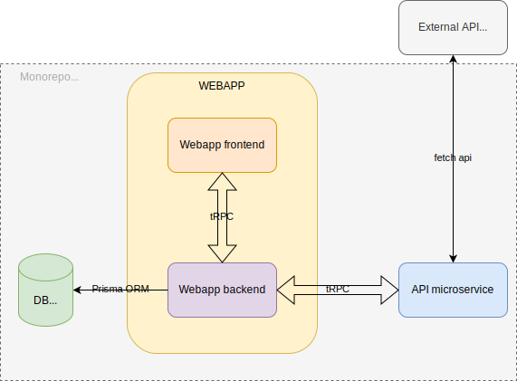
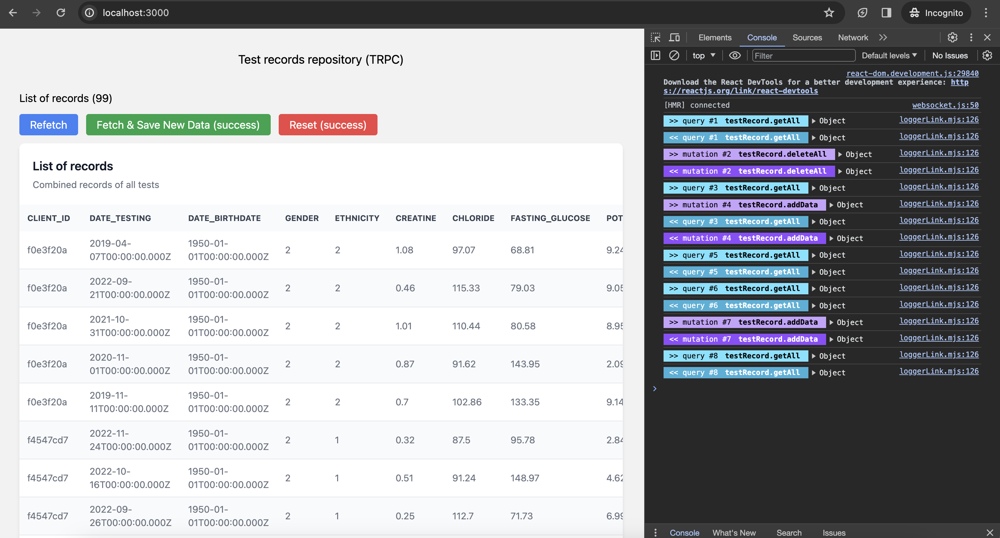

## Example NextJS app w/ `tRPC`

> This is a demo project to utilize `tRPC` to demonstrate communications not just between server side and front facing side of SSR apps, also between microservices in a monorepo.

## Project structure

The project is mainly divided into 2 directories,`webapp` for front-facing Webapp and the `API` for microservice for proxying an external API. Each has a corresponding `Dockerfile` for ease of development and later deployments. Additionally, this project has `Postgres` DB dependency.

> For local dev, I've set up an docker configs defined in [`docker-compose.yaml`](docker-compose.yml) file. In this file, I've listed all the environment variables used throughout the project.



## 1. API (micro-service) to proxy external API

The simple API server for proxying an external API url to be defined in `PROXY_API_URL` environment variable.

- [x] [express.js](https://expressjs.com/)
- [x] [tRPC](https://trpc.io/) for type-safe communications

> [./api/api.ts](./api/api.ts)

```ts
import { initTRPC } from '@trpc/server';
import { createExpressMiddleware } from '@trpc/server/adapters/express';
...
const appRouter = t.router({
  fetchRecords: t.procedure
    .input(z.number())
    .output(z.array(z.array(rowSchema)))
    .query(async ({ input }) => {
      if (!PROXY_API_URL) return [];
      return await Promise.all(
        Array(input)
          .fill(0)
          .map(() => fetch(PROXY_API_URL).then((response) => response.json()))
      );
    }),
});
```

## 2. Postgres DB

`Postgres` db is used with `Prisma ORM`. It then adds `tRPC` and it's a dream come true ;)

In this project, I set up only one table (`TestRecord`) to store records fetched from the `external api`. The schema is defined in [./webapp/prisma/schema.prisma](./webapp/prisma/schema.prisma)

```schema.prisma
model TestRecord {
  id                   String   @id @default(cuid())
  client_id            String
  date_testing         DateTime @db.Date
  gender               Int

  ...

  created_at           DateTime @default(now())

  @@map(name: "test_records")
}
```

## 3. WEBAPP

> This is a [Next.js](https://nextjs.org/)-based full-stack app utilizing [tRPC](https://trpc.io/) for type-safe communication between back-end, front-end and an additional `API` microservice from the above section.

#### Tech Stack

- [x] [Next.JS](https://nextjs.org/)
- [x] [tRPC](https://trpc.io/)
- [x] [Prisma](https://www.prisma.io/) (with [Postgres](https://www.postgresql.org/) db)
- [x] [Tailwind.css](https://tailwindcss.com/)

Set environment variables in `.env` file

```yaml
# .env file
POSTGRES_PRISMA_URL=
PORT=3000
```

#### Webapp -> API Microservice Communications

To enable `tRPC` communications between the `API` microservice, I have used mono-repo deliberately, so that I can import `tRPC` router types named `ExtApiRouter` from `./api/api.ts`.

```ts
// ./webapp/src/utils/ext-api.ts
import { createTRPCClient, httpBatchLink } from '@trpc/client';
import type { ExtApiRouter } from '../../../api/api';

export const extApiClient = createTRPCClient<ExtApiRouter>({
  links: [
    httpBatchLink({
      url: process.env.API_TRPC_URL ?? `http://localhost:3005/trpc`,
    }),
  ],
});
```

### Further Improvement Ideas

- [ ] Integrate `npm`'s workspace to better structure the monorepo
- [ ] Add a separate table for user details
- [ ] Add test cases
- [ ] Add pagination to webapp

## Local Demo:

This project is set up using `Docker Compose`.
To try this demo on your local dev env it only requires running `docker` instance and `docker compose up`.
If you want to change ports and other env variables, take a look at the [./docker-compose.yml](./docker-compose.yml) file.

```bash
docker compose up
```

Open [http://localhost:8082](http://localhost:8082)



## Live Demo:

For the live demo, I have set up a `Vercel` deployment with a `Postgres` DB instance provided by Vercel.

> [https://alpine-ganni.vercel.app](https://alpine-ganni.vercel.app/)
